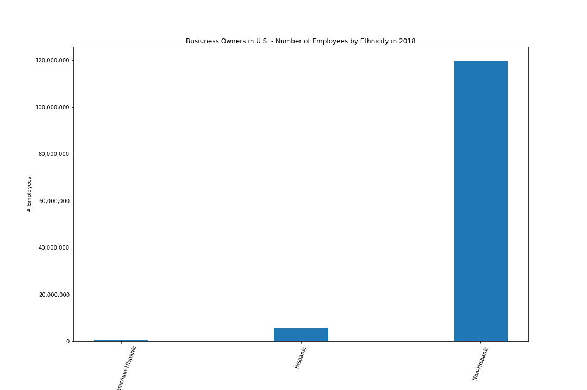
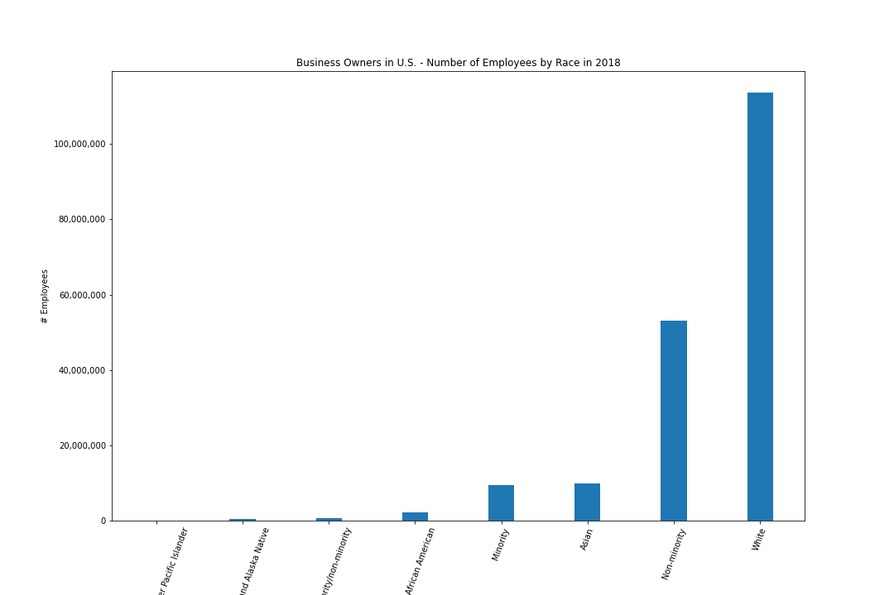
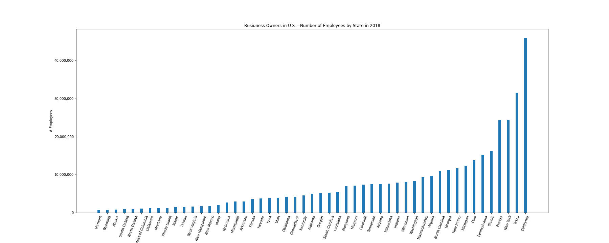

## Census Data Visualizations from the 2018 Annual Business Survey

## Description
This project involves creating visualizations from the 2018 annual business survey. Visulalizationsa are created using the python pandas and matplotlib libraries.

## Sources
[Annual Business Survey from the 2019 ACS](https://www.census.gov/data/developers/data-sets/abs.2019.html)

## Visualizations

The number of employees aggregated by the ethnicity of the business owner in the U.S. in 2018.

The number of employees aggregated by the race of the business owner in the U.S. in 2018.

The number of employees aggregated by state in the U.S.